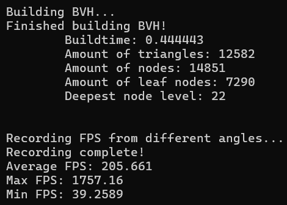
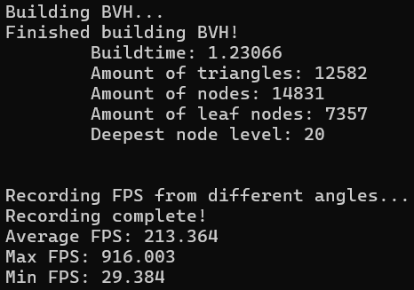
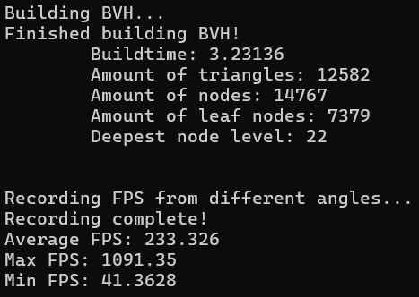
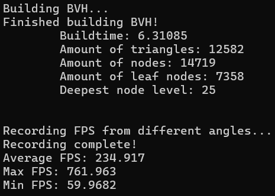

# vulkan-bvh-construction
WIP repo for BVH construction.<br>

## Performance tests
These tests were run on a laptop with different background tasks and battery level each time. For this reason they are not exact, but should still represent the overall increase in performance with each improvement of the BVH/traversal algorithm.

### Naive BVH / simple halfway split


### Binned SAH
#### 3 splits


#### 10 splits


#### 20 splits


## Setup
### Download Vulkan SDK
Go to [LunarXchange](https://vulkan.lunarg.com) to download the version of Vulkan SDK appropriate for your system.

### Clone repository and fetch external dependencies
```sh
$ git clone https://github.com/Thefantasticbagle/vulkan-bvh-construction.git
$ cd vulkan-bvh-construction
$ git submodule init
$ git submodule update
```

### Build the project
For this step, cmake is required.
```sh
$ mkdir build
$ cd build
$ cmake -S ../ -B ./
```
Lastly, use Visual Studio to open `vulkan-bvh-construction.sln`, and build for Release! You may have to set vulkan-bvh-construction as "Startup project".
(Building for Debug enables Validation layers and lowers performance)
